# 🏗️ BarakahVault System Architecture

## 1. High-Level System Overview

This diagram illustrates the comprehensive architecture of the BarakahVault ecosystem, connecting the Frontend, Backend, Blockchain, and External AI/Data services.

```mermaid
graph TB
    subgraph Client ["💻 Client Side"]
        NextJS["Next.js Frontend (React)"]
        MetaMask["🦊 MetaMask Wallet"]
    end

    subgraph Backend ["🚀 Backend Services"]
        API["Node.js / Express API"]
        Auth["Auth Service (JWT/NextAuth)"]
    end

    subgraph Database ["💾 Data Storage"]
        MongoDB[("MongoDB (User Data, Projects)")]
    end

    subgraph Blockchain ["⛓️ Blockchain Layer"]
        Polygon["Polygon Network (Amoy Testnet)"]
        SmartContracts["Smart Contracts (Solidity)"]
        Escrow["Escrow Contract"]
        NFT["NFT Receipt Contract"]
    end

    subgraph External ["🌐 External Services"]
        OpenAI["🤖 OpenAI API (Maqasid Analysis)"]
        StockAPI["📈 Stock Data API"]
        NewsAPI["📰 Islamic Finance News API"]
    end

    %% Connections
    NextJS -->|HTTP Requests| API
    NextJS -->|Web3 Connection| MetaMask
    MetaMask -->|Sign & Send| Polygon
    
    API -->|Read/Write| MongoDB
    API -->|Analyze Companies| OpenAI
    API -->|Fetch Prices| StockAPI
    API -->|Get Updates| NewsAPI
    
    Polygon -->|Execute| SmartContracts
    SmartContracts -->|Manage Funds| Escrow
    SmartContracts -->|Mint Proof| NFT
```

## 2. Core User Flow

The journey of a user through the three main pillars: Investing, Zakat, and Giving.

## 3. Maqasid AI Scoring Pipeline

How we process company data to generate an Islamic ethical score.

```mermaid
flowchart LR
    Input[("🏢 Company Input<br>(Ticker/Name)")]
    
    subgraph DataCollection ["📊 Data Collection"]
        FinData["Financial Data<br>(Debt, Revenue)"]
        ESG["ESG Reports<br>(Environment, Social)"]
        News["News Sentiment"]
    end

    subgraph Analysis ["🧠 Maqasid AI Analysis"]
        Faith["Faith (Deen)<br>Halal Check"]
        Life["Life (Nafs)<br>Safety/Labor"]
        Intellect["Intellect (Aql)<br>R&D/Innovation"]
        Lineage["Lineage (Nasl)<br>Family Impact"]
        Wealth["Wealth (Mal)<br>Fairness"]
    end

    Output[("⭐ Final Score<br>(0-100)")]

    Input --> FinData
    Input --> ESG
    Input --> News
    
    FinData --> Faith
    ESG --> Life
    News --> Analysis
    
    Faith --> Output
    Life --> Output
    Intellect --> Output
    Lineage --> Output
    Wealth --> Output
```

